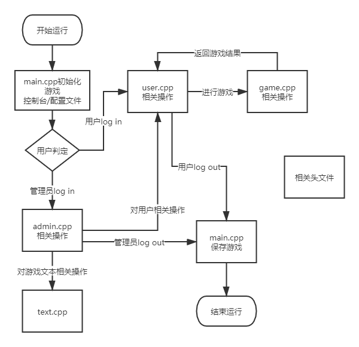

# 打字游戏 Typing Game 设计文档

## 需求概述

程序实现一个带管理员后台的多用户的CLI打字游戏。游戏中打字内容设定难度分级，支持中文、英文及中英文混合，支持保存游戏记录。程序运行环境为Windows x64。

## 总体架构



- admin.h和admin.cpp 实现管理员的相关操作

管理员密码设定、管理员密码修改、管理员对用户组的各种操作、管理员对游戏配置的各种操作

- game.h和game.cpp 实现游戏内容

主要的游戏内容，具体实现见代码

- record.h 提供了对游戏记录的定义

```c++
struct Record
{
	tm time;
	int used_time;
	int text_id;
	int user_id;
};
```

游戏记录包含游戏时间、游戏用时、游戏文本的编号、用户编号

- text.h和text.cpp 实现游戏文本的相关操作

构建两个类，`class Words{}`和`class Text{}`分别实现对多单词的文本的操作和对多行的文本的操作

人为地，令所有多单词文本的`text_id`最后1位为偶数，所有多行文本的`text_id`最后1位为奇数，以实现数据读入、存储时的快速区分。

- user.h和user.cpp 实现用户的相关操作

构造一个所有用户类

```c++
class User
{
public:
	//相关函数
private:
	std::vector <User_Info> all_user_;
};
```

某个用户的信息由编号、不含空格的昵称和不含空格的密码组成

- main.cpp 实现对整个程序的控制

`int main()`开头实现从已存在的配置文件game.data（或全新地从控制台）初始化游戏

`return 0`前实现将游戏保存到配置文件game.data

## 需求

管理员需求：

1. 管理员自身信息修改
2. 对用户信息进行增删改
3. 对游戏配置进行增删改

用户（玩家）需求：

1. 注册、登录、登出、注销
2. 进行游戏
3. 查看自己的所有游戏记录
4. 查看某游戏关卡（即某文本）的所有玩家的游戏记录
5. 查看某玩家的游戏记录
6. **对其他玩家的记录发起挑战(feature)**

